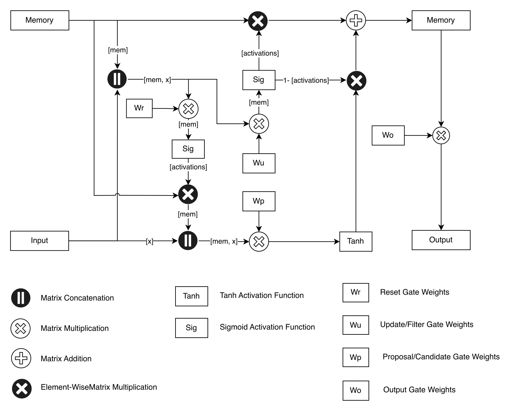

# Language Model Training Pipeline

A modular pipeline for training language models with custom tokenizers.

## Project Structure

- `main.py`: Main training script
- `config.py`: Configuration and hyperparameters
- `models/`: Model architectures
- `data/`: Data loading and preprocessing
- `training/`: Training loops and utilities
- `tokenization/`: Tokenizer training pipeline
- `inference/`: Scripts for testing trained models and tokenizers

## Model Architecture

This project implements a custom **GRU-based Language Model** with the following architecture:

### Overview
The model uses Gated Recurrent Units (GRUs) with layer normalization for stable training. It processes text sequences token-by-token, maintaining a hidden state that captures contextual information.

### Architecture Diagram


**Note**: The `model_arch.jpg` file should be in the project root showing the GRU architecture flow.

#### ASCII Architecture Overview:
```
Input Tokens → Embedding → [GRU Cell] → Output Logits
                        ↓
                   Hidden State
                        ↗
              Reset/Update Gates
```

Where GRU Cell contains:
```
Input + Prev Hidden → Layer Norm → Reset Gate → * Prev Hidden → Layer Norm → Candidate
                        ↓                                           ↓
                   Update Gate ←─────────────────────────────┐
                        ↓                                   ↓
              Interpolate: (1-z)*old + z*new ←───────────────┘
```

### Components

#### 1. **Input Embedding Layer**
- Converts input token IDs to dense vector representations
- Dimension: Configurable (default: 512)

#### 2. **GRU Cell**
The core recurrent component with three gates:

- **Reset Gate (W_r)**: Controls what information from the previous hidden state to forget
- **Update Gate (W_z)**: Determines how much of the new candidate to incorporate
- **Candidate Gate (W_n)**: Computes the new memory candidate using reset-filtered previous state

#### 3. **Layer Normalization**
- Applied to concatenated inputs and hidden states for training stability
- Helps prevent gradient vanishing/exploding issues

#### 4. **Output Projection**
- Linear layer mapping hidden states to vocabulary logits
- Dimension: Vocabulary size × Hidden dimension

### Forward Pass
1. **Token Processing**: Each input token is embedded and processed sequentially
2. **Gate Computation**: Reset and update gates control information flow
3. **State Update**: Hidden state updated via gated interpolation between old and new candidates
4. **Prediction**: Output logits generated for next token prediction

### Key Features
- **Layer Normalization**: Stabilizes training and improves convergence
- **Custom GRU Implementation**: Full control over gating mechanisms
- **Flexible Dimensions**: Configurable embedding and hidden sizes
- **Text Generation**: Built-in generation with temperature, top-k, and nucleus sampling

### Training Details
- **Loss**: Cross-entropy loss on next-token prediction
- **Optimization**: Adam optimizer with configurable learning rate
- **Regularization**: Layer normalization (no explicit dropout)

## Training a Model

1. Train a tokenizer:
```bash
python tokenization/main_tokenizer.py --tokenizer-type byte_level_bpe
```

2. Train the model:
```bash
python main.py
```

## Supported Tokenizer Types

- `byte_level_bpe`: Byte-level BPE (default)
- `char_bpe`: Character-level BPE
- `bpe`: Word-level BPE
- `word_level`: Word-level tokenizer

## Inference

See `inference/README.md` for testing trained models and tokenizers.